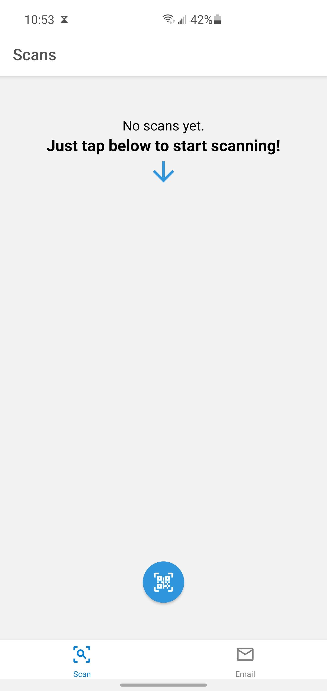
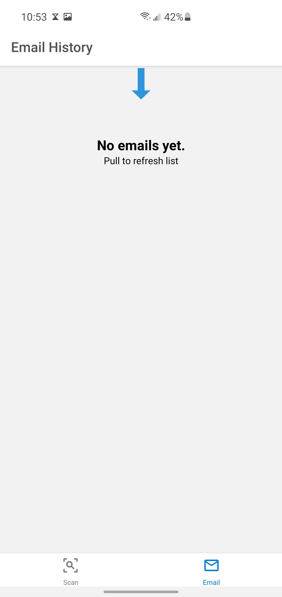
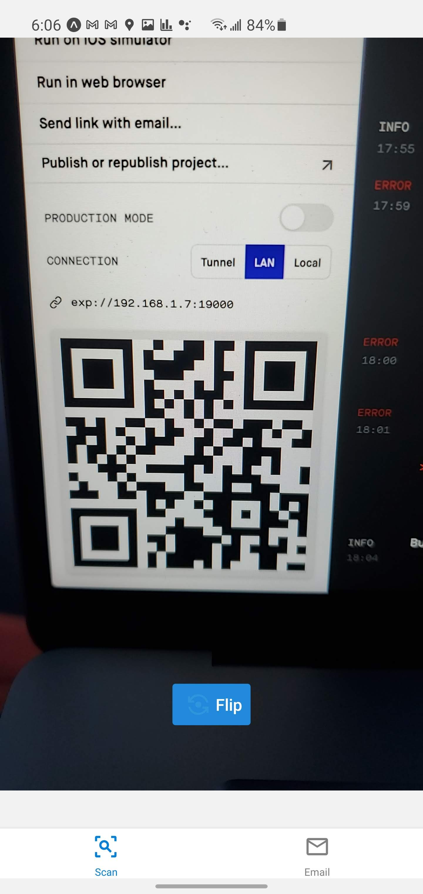
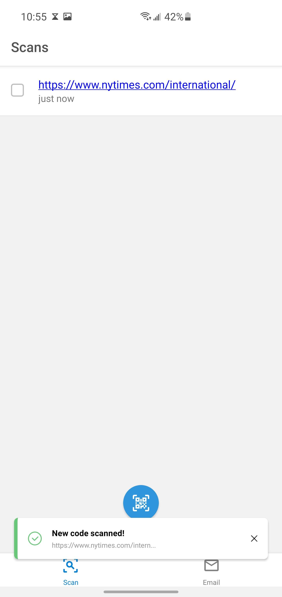
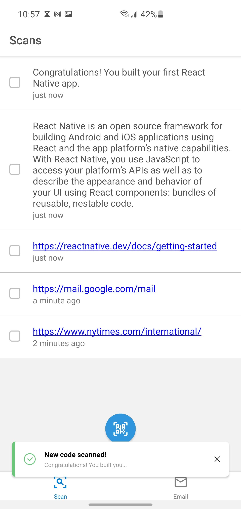
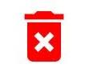
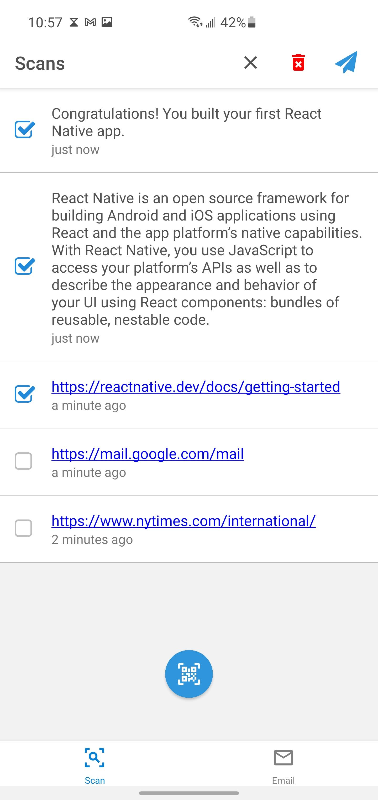
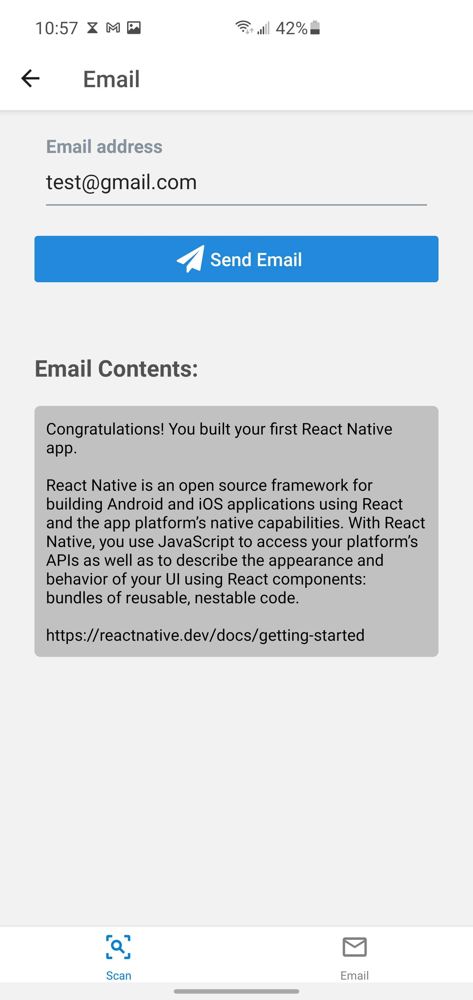
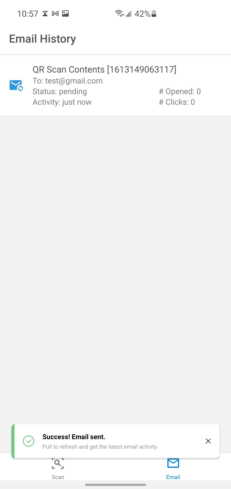
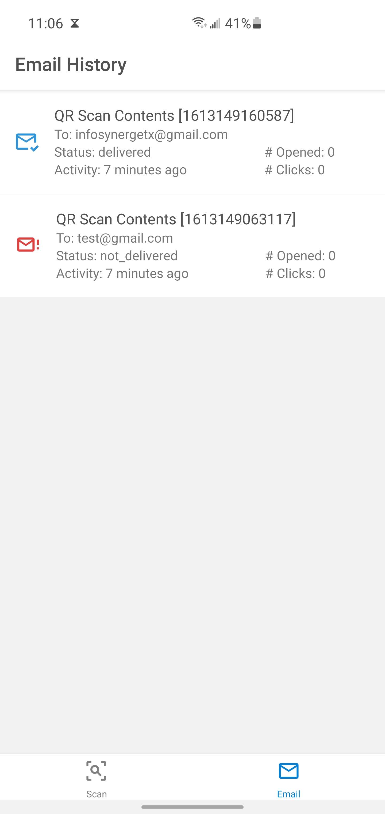

# mobile-scanner

React Native application for using the device’s camera to scan QR codes and store the collected text for further emailing and tracking emails sent.

# ABOUT

## Start

### App starts empty, just start scanning to see it in action.

 
 

### Scan some QR Codes:

 
 

### Select one or many. Tap  icon to delete or  to send an email:

 
 

### Tap `Send Email` to send:

 
 

### Pull-to-refresh on the `Email` tab to get the lastest activity from SendGrid

 
 
 

# DEVELOPMENT

### PREREQUISITES

-   global npm packages:

    -   `expo-cli`
    -   `npm`
    -   `typescript`

-   local environment variables for secret keys:
    -   set `SENDGRID_API_KEY=XXXXX` in the root folder in a `.env` file

### START

-   Clear out previous build cache
    -   `watchman watch-del-all`
    -   `rm -rf node_modules/.cache/babel-loader/*`
    -   `rm -fr $TMPDIR/metro*`
-   Run `yarn` to install dependencies
-   Run `yarn start` to start the local Expo server
-   Scan QR code with Expo app on device to preview app
